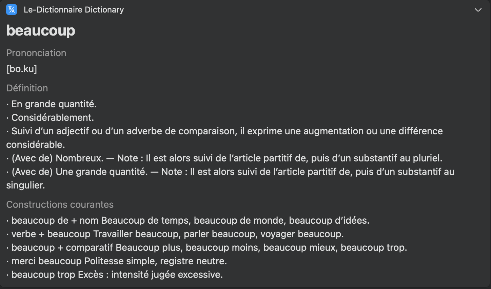

# Fr-FR Dict Bob Plugin

Bob plugin for https://www.le-dictionnaire.com. Built with TypeScript, Cheerio, and esbuild.

## Screenshot


## Local Build
```bash
npm install
node build.js
```
Output: `release/bob-plugin-le-dictionnaire@<version>.bobplugin`

## Plugin Icon
Place your icon at `static/icon.png` (recommended 512x512). It will be packaged into the plugin automatically.

## Release (GitHub)
1. Update `package.json` version.
2. Commit and push to `main`.
3. Tag and push:
```bash
git tag v<version>
git push origin v<version>
```
4. GitHub Actions will build and attach the `.bobplugin` to the Release, and update `appcast.json`.

## Links
- Repo: https://github.com/callmeeric5/bob-plugin-frdict
- Appcast: https://raw.githubusercontent.com/callmeeric5/bob-plugin-frdict/main/appcast.json
